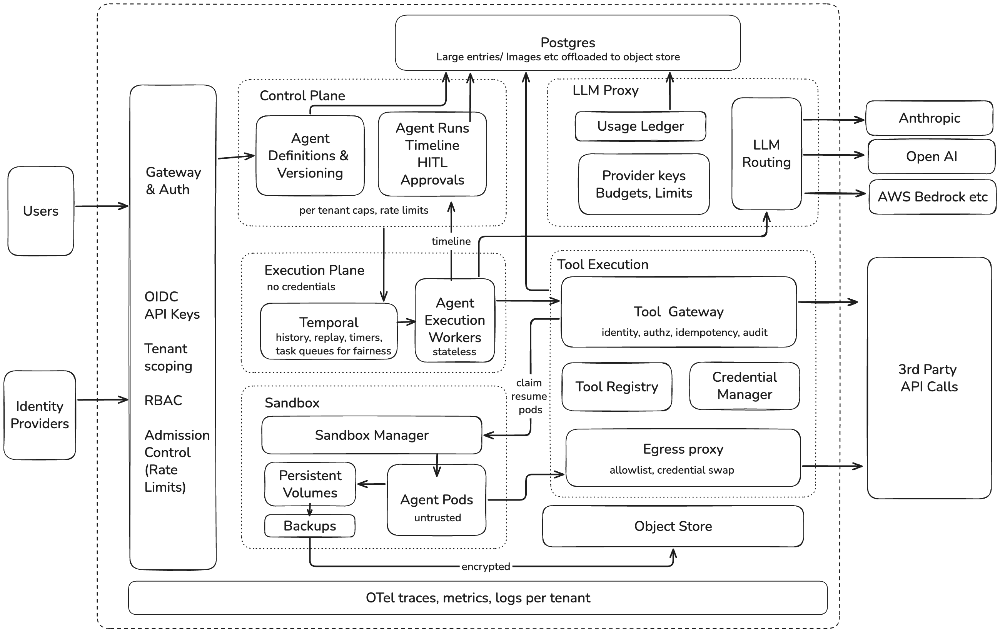
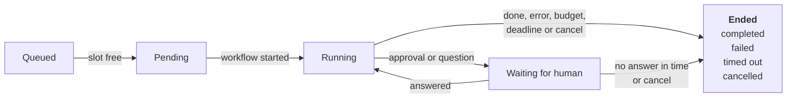
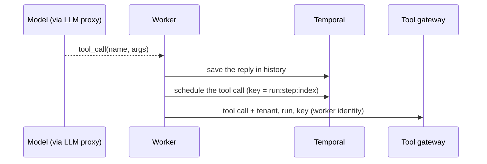
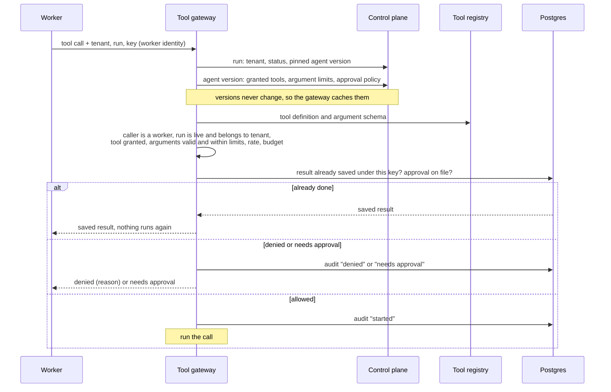
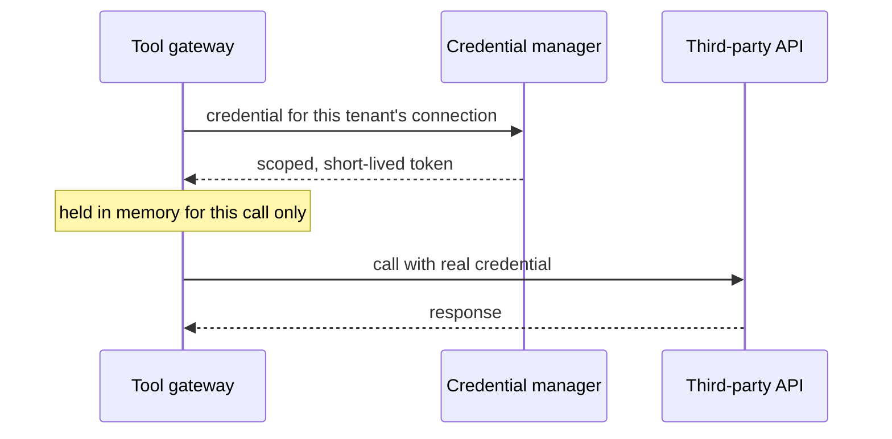
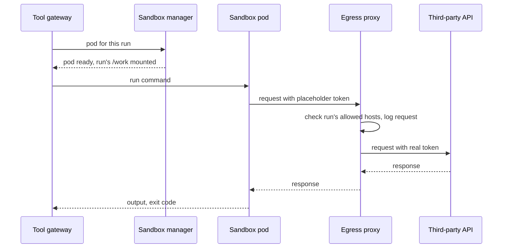
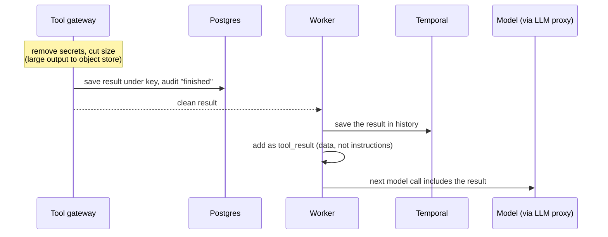

# Agent Orchestration platform

## 1. System diagram

All data is scoped to its tenant: database rows, files, workflow history, logs, metrics and credentials.

## 2. Agent lifecycle

### 2.1 Agent definition and versioning

An agent is a record: its owner, system prompt, model, the tools it may call and limits on their arguments (such as which repos or domains), which calls need a human's approval, and its budget and time limits. Each save creates a new version, identified by a hash of its content, that never changes. A run is pinned to the version it started with, so editing an agent never affects runs already going, and the audit log can name the exact version behind every call.

### 2.2 Agent run

**At runtime an agent run is a Temporal workflow plus a row in Postgres. A pod is only used for execution tools.** Agents spend most of their time waiting: on the model, on tools, on people for days. A pod per agent would sit idle holding memory and lose its state when it died.

**Start**
- A run request names an agent. The control plane pins the agent's current version and saves the run as `pending`.
- If the tenant is at its run cap, the run waits as `queued` until one of the tenant's runs ends.
- The control plane starts a workflow with the run ID as its ID and a policy that rejects reusing it, so a retried start can't create a second run. A sweeper retries runs stuck in `pending`, for example while Temporal is down.

**Running**
- Each step goes on a Temporal task queue. Workers get steps fairly by tenant, weighted by plan, with interactive runs ahead of batch ones. The number of workers scales with queue length.
- Steps aren't tied to a worker; any free worker runs the next one. A run gets a warm sandbox pod only on its first execution tool call, and keeps it until the run ends or goes idle.
- Temporal history holds every model reply and tool result, saved before the next step starts. The control plane keeps status and the timeline, the tool gateway keeps approvals, and the run's files live on its own volume. Large payloads go to the object store, and the history keeps a reference.

**Waiting for a human**
- A run pauses when a tool call needs approval or the model asks the user something. The workflow waits for a signal, with a timer, and holds no worker.
- When the user answers, the control plane checks their role and signals the run. The tool gateway checks the approval again before the call runs.
- A chat reply is only input to the model and never counts as an approval.
- After a set idle time (default 15 minutes) the sandbox's files are saved and its pod deleted. The files come back on the next execution tool call; running processes don't.

**Timeouts**
- Model and tool calls: each has a timeout and is retried. Retries are safe because the tool gateway returns the saved result for a repeated call.
- Human answer: set per agent (default 7 days). After that the run times out.
- Whole run: a deadline.
- Budget: running out of tokens or $ fails the run.

**Ending**
- A cancel works from any state. Running calls stop at their next heartbeat, and cleanup still runs: release the sandbox, write the final status, add an audit entry.
- Every run ends in exactly one state: completed, failed, timed out or cancelled.

### 2.3 Durable execution

Uses Temporal for durable workflow execution. Holds no credentials.

- Each run is a workflow, and stateless workers run its steps: call the model, call tools, save the result.
- Every step is saved in Temporal's history, so if a worker crashes or is redeployed, another worker replays the history and carries on.
- A run waiting on a human holds no worker, only a timer.
- Temporal's task queues share workers fairly between tenants.
- Workers serve all tenants and run only platform code, never tenant code. They treat model and tool output as data, not commands.

## 3. Tool call path

The only part that holds tenant credentials, and it adds them only at the moment of a call.

- The tool gateway checks every tool call (caller, tool access, arguments, budget, approval) and stores its approvals. It logs each call before and after it runs, and saves each result under a key, so a retry gets the saved result instead of acting twice. It removes secrets from every result and cuts oversized output before it goes back to the model.
- The tool registry holds tool definitions.
- The credential manager keeps tenant credentials encrypted and, when possible, issues short-lived, narrowly scoped tokens.
- The egress proxy lets a sandbox reach only the hosts its run allows, and swaps the placeholder token for the real one on the way out. It logs every outbound request.

**A. Model output to gateway request**

**B. Checks in the tool gateway, before anything runs**

**C. API tool: the gateway adds the credential**

**D. Execution tool: the sandbox runs it, the egress proxy adds the credential**

**E. Result back into the model's context**

## 4. Sandbox design

One untrusted gVisor pod per run, never reused, with no real tokens.

**One pod per run**
- The sandbox manager keeps warm pods ready and gives one to a run on its first execution tool call.
- After a set idle time (default 15 minutes) it saves the files and deletes the pod. The run's volume is kept for a set time (default 24 hours), then only its backup in the object store.

**Isolation: gVisor**
- gVisor runs a small kernel in user space that handles the pod's system calls, so the host kernel only sees a small, filtered set. It runs real CLIs (`git`, `gh`, `pandoc`, `pip`) unchanged, and on managed Kubernetes it's just a `RuntimeClass`. Cost: slower on heavy file I/O, such as `npm install` and large builds.
- Plain containers: rejected. They share the host kernel, so one kernel bug gives away the node.
- Kata / Firecracker: the upgrade path. Each pod gets its own kernel, which is the strongest boundary, but they need nested virtualization or bare metal and more memory per pod. Moving a tenant over needs nodes that support VMs, its own warm pool and a `RuntimeClass` change.
- WebAssembly: rejected. It can't run arbitrary CLIs.
- Remote executor services (E2B, Modal): rejected. Tenant code and data leave our cluster, and we depend on a vendor.

**Filesystem**
- Read-only root image with the common tools. `/work` is the run's own volume and the only thing that persists; `/tmp` is small and goes away with the pod.
- No host paths, no mounted secrets, no Kubernetes service account token. The only token in the pod is one the egress proxy uses to identify it.
- Runs as non-root, with all Linux capabilities dropped, no privilege escalation, and a filter that blocks risky system calls (seccomp).

**Network**
- Default-deny NetworkPolicy. Out: only the egress proxy. In: only the tool gateway, to a small exec agent in the pod.
- No DNS: the proxy resolves names, which closes DNS tunnelling. No cluster services, Kubernetes API or cloud metadata endpoint.
- A CLI that ignores the proxy settings simply can't connect.

**How `gh` gets a token without the agent reading it**
- The pod has `GH_TOKEN=ph_…`, a placeholder that only works for this run and for `api.github.com`.
- `gh` sends its requests through the egress proxy. The proxy terminates TLS (the pod trusts the platform's CA), checks the run's rules for host, method and path, and swaps in a real GitHub App token: one repo, minimum permissions, valid for one hour.
- `git` over HTTPS works the same way. `echo $GH_TOKEN` prints only the placeholder, responses are scanned so the real token is never echoed back, and a stolen placeholder is useless anywhere else.

**Resource limits**
- Per pod: CPU 0.25 requested / 2 max, memory 2Gi requested and max (memory can't be slowed down like CPU, so it isn't overcommitted), limits on processes and temp disk, a 10Gi volume.
- Per command: a timeout, plus the run's deadline.
- Per tenant: a cap on sandbox pods running at once.
- Sandbox pods run on their own spot nodes, which hold nothing else and are replaced regularly.

**Cold start**
- A run normally gets a warm pod in under 1s. The pod is already running and only needs a label.
- If a burst empties the pool, a new pod takes 2–5s, or 60–90s when a new node is needed. The 60–90s is hidden by low-priority placeholder pods on spare nodes, which a real sandbox pushes out at once.
- Resuming after idle takes 5–10s to reattach the volume, longer from a backup.

**When a sandbox is compromised**
- The attacker gets this run's files, CPU within limits, and only the requests this run's egress rules allow.
- They don't get real secrets, other pods, the Kubernetes API, the metadata endpoint or another tenant's data.
- Escaping needs a gVisor bug, and then a way past the filter that lets gVisor itself make only a few dozen host system calls. Even then it lands on a node that runs only sandboxes and holds no secrets.
- Detect: spikes in blocked requests, unusual system calls (gVisor, Falco), CPU pinned at the limit, attempts to reach the metadata endpoint or cluster IPs.
- Respond: kill the pod, fail the run, revoke its credentials, keep the volume for forensics, record it in the audit log and alert the tenant. Drain the node if escape is suspected.

## 5. Scaling and cost

**Load at peak:** 1,000 agents, ~60% active, one step every ~10s each, so ~60 steps/s. 10k tool calls/min is ~167/s. About 60% of those are execution tools taking ~1s, so ~100 commands run at once. At ~20k input tokens per step, that's ~72M tokens/min.

**Mapping onto nodes**
- Most of the 1,000 agents are just rows. Pods exist only for sandboxes: ~470 at peak, at 2Gi each, on ~17 spot nodes with 16 vCPUs and 64GiB.
- Workers are a few shared pods, scaled on Temporal queue length. The platform services take ~4 on-demand nodes.
- A 9am burst of 300 agents: runs over the tenant cap queue, and pods are claimed only at the first execution tool call. The warm pool and placeholder pods cover the rest. At noon the empty sandbox nodes scale away.
- At 10x: ~170 sandbox nodes, split into cells. Each cell is an independent stack serving a fixed set of tenants. Temporal's shard count is set for 10x on day one, because it can't be changed later. The LLM provider runs out of capacity before the cluster does.

**Per agent vs shared.** Each run has its own workflow, rows and volume, plus a sandbox pod only while it runs execution tools. Everything else is shared: workers, Temporal, Postgres, Redis, the tool gateway, the egress and LLM proxies, and the warm pool.

**Idle agents.** A run waiting two days on a human is a timer and a few rows, holding no worker or memory, and its pod is deleted after the idle time. Two days cost ~$0.035 of storage, against ~$1 to keep a pod running.

**Cost.** Infrastructure is ~$8–13k/month, about $0.02 per active agent-hour. The LLM is ~$9 per active agent-hour, about 99% of spend. So the levers are prompt caching, shorter context, cheaper models for easy steps, and per-tenant budgets.

### 5.1 LLM proxy

Every model call goes through it. Holds the provider keys.

- Routes each call to a provider, and switches providers when one is down.
- Records tokens and cost for every call, and keeps each tenant within its budget.
- Shares rate limits fairly:
  - Redis holds a token bucket per tenant and model. It refills at the tenant's share of the provider's limit, weighted by plan and split among the tenants active right now.
  - A call reserves its input plus maximum output tokens up front, and gives back what it didn't use.
  - Share a tenant isn't using goes to tenants who need more, so no capacity sits idle.
  - 20% is kept for interactive runs, so batch jobs can't starve a user who is watching.
  - An empty bucket fails fast and Temporal retries later, so a throttled run holds no worker.
  - The same plan weight drives Temporal's fair queues, so workers and model access are shared the same way.

## 6. Failure modes

**Node lost mid-tool-call**
- **Worker node.**
  - Detect: the call's heartbeat stops, and Temporal times it out in ~30s.
  - Recover: Temporal retries on another worker with the same key. If the gateway already saved a result, it returns it and nothing runs twice. If the call started but never finished, the gateway uses the provider's idempotency key or checks for a marker it tagged the action with. Failing both, it marks the call unknown and asks a human.
- **Sandbox node.**
  - Detect: the command's connection breaks, and the gateway reports the sandbox lost.
  - Recover: a new pod with the run's volume or its last backup. The model is told the command was interrupted and decides whether to rerun it. The egress log shows what the command already sent.

**Poison agent looping on tool calls**
- Detect: the same tool and arguments repeated N times, too many calls per minute, the step cap (e.g. 200), or the budget running out.
- Recover: first tell the model it's repeating itself. If it continues, pause for a human or fail the run. If many runs of one agent version loop, block new runs of that version and alert its owner. The step cap, rate limit and budget limit the damage.

**LLM provider or tool API down**
- Detect: error, 429 and latency rates, per provider at the LLM proxy and per tool at the gateway.
- Recover: retries with backoff on the Temporal side, holding no worker. Then switch providers if the agent allows it, or return a fast "tool unavailable" so the model can wait or try another way. Runs slow down; they don't fail.

**Temporal or Postgres down**
- Detect: health checks, errors starting workflows.
- Recover: new runs wait as `pending`, and the sweeper starts them later. Running runs pause and carry on from history. The control plane rebuilds any timeline rows it missed, from history.

**One tenant's burst**
- Detect: queue backlog, sandbox pods and LLM bucket use, per tenant.
- Recover: nothing breaks. Caps queue the excess, fair queues and buckets keep other tenants' latency normal, and new nodes take the legitimate load.

## 7. Three hardest decisions

**1. Temporal for runs, not a Kubernetes CRD or Jobs**
- Hard because: the brief asks for Kubernetes-native, an `AgentRun` CRD with a controller is the obvious fit, and it's one less system to run.
- Rejected: a CRD or Jobs. We'd have to rebuild what Temporal already gives us: per-step history, replay after crashes, timers and signals for multi-day waits, retries, fair queues. etcd is the wrong store for per-step state of 1,000 runs, let alone 10,000. A Job ties a run to a pod, so waiting costs a pod.
- Would reverse if: runs became short and never waited on people, or running Temporal at 10x cost more than the team can support and Temporal Cloud isn't an option.

**2. gVisor, not microVMs (Kata, Firecracker)**
- Hard because: it's the main defence against untrusted code, and a microVM's own kernel is a stronger wall.
- Rejected: microVMs as the default. They need nested virtualization or bare metal, more memory per pod, and heavier warm pools. gVisor already keeps the code off the host kernel, and the damage is limited separately: no secrets in the pod, dedicated nodes.
- Would reverse if: a tenant contractually requires VM isolation, a gVisor escape is published, or gVisor's gaps break common workloads. Switching a tenant needs nodes that support VMs, its own warm pool and a `RuntimeClass` change.

**3. Credential swap at the egress proxy, not scoped tokens in the pod**
- Hard because: it's the most complex piece. It needs TLS interception, a platform CA in every pod, and special handling for each signing scheme and for non-HTTP protocols.
- Rejected: short-lived, narrowly scoped tokens in the pod's environment. Much simpler, but any code in the pod can read the token and send it anywhere while it's valid, and prompt injection can make that code an attacker's.
- Would reverse if: providers offer tokens scoped so tightly that a leak is harmless (one repo, one action, minutes), or TLS interception breaks too many tools.

## 8. What we cut

We would need some version of these in production, but each can be added without changing the design's invariants.

- Agent intelligence (planning, context gathering, memory, content guardrails)
- Multi-agent and RAG pipelines
- Multi-region and disaster recovery
- Auth, payments, user/team/org management
- Policy-based authorization for users and tool calls

## 9. Trade-off positions

- **Stateless workers replaying history.** Agents mostly wait, so a process per agent would hold memory for days and lose its state in a crash. This changes if agents need sub-second turns with large in-memory state that's too costly to rebuild.
- **One warm pod per run.** Agents build up files across commands. A pod per call would mean ~100 pod starts a second, and a shared pool leaks files between tenants. This changes if most execution tools turn out to be one-shot commands that need no earlier files, or if pods can be reset to a known-clean snapshot between runs fast enough to make a shared pool safe.
- **Authorization at the tool gateway.** One place checks every call the same way. Showing the model only its granted tools, and scoping credentials, both help, but neither is the control. This changes if a tool needs rules only it can check, such as database row permissions; then that tool checks them too.
- **An application scheduler on Temporal, with Kubernetes only for sandbox pods.** Runs need per-step history, timers for multi-day waits and fair queues. A CRD controller would have to rebuild all of that on etcd, and a Job would hold a pod while the run waits. This changes if runs become short and never wait on people, or if we need more control over scheduling than Temporal gives.
