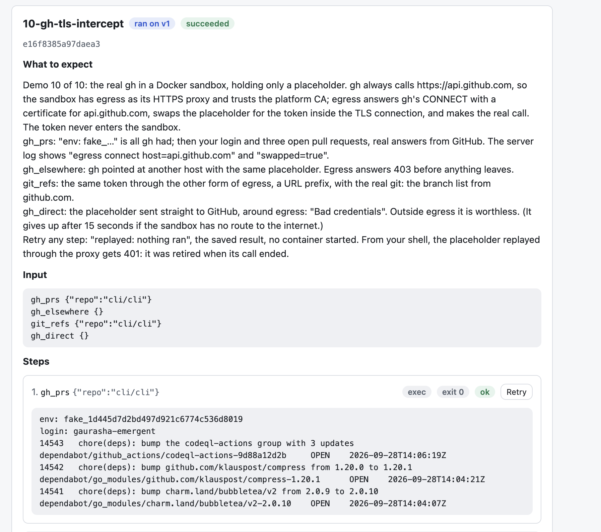

# agentic_orchestration_framework

The tool call execution layer of a platform that runs AI agents for many tenants. Ten seeded demos, one per part of the design, run end to end, all in memory. Start at [src/AGENT.md](src/AGENT.md).

```bash
make run                                         # API :8080, egress :8081, UI :5173; commands as local processes; demos 1 to 9
GH_CLI_TOKEN=$(gh auth token) make run-sandbox   # the same with the Docker sandbox on Colima, for demo 10 (gh)
```

Each prints the URL to open: http://localhost:5173, sign in as `acme`. Ctrl-C stops the server and the UI together, and either target refuses to start while an earlier one still holds a port.

## The ten demos

The server seeds tenant `acme` at start with the tools, a credential, ten agents named `01-…` to `10-…`, and a run of each, so every part of the design is on the Executions tab before anything is typed. Each run opens with **What to expect**: what its steps should show and what that proves. Runs you start can carry such a description too. `SEED=<tenant>` seeds another tenant; `SEED=none` starts empty.

| # | Agent | Part of the design | What the run shows |
|---|---|---|---|
| 1 | `01-credential-hidden` | The gateway adds the credential and hides it | The echo service reports `Authorization: Bearer [secret]`; the model, the UI and the API only ever see `[secret]` |
| 2 | `02-refusals` | The checks before a call: registry, grant, JSON Schema, allowlist | Four refusals, each with its reason (Tokyo outside the allowlist, `delete_repo` not in the registry, `city` not a string, `city` missing), then one ok |
| 3 | `03-budget` | A tool call budget per run | Two calls ok, the third refused as *budget exhausted*; the refusal before them cost nothing |
| 4 | `04-retry-journal` | Idempotent retries through the journal | A replayed step, *replayed: nothing ran*, with the same `"request"` number: the service saw one request |
| 5 | `05-approval` | A human approves a call | Waiting for your approval with nothing run; Approve runs it marked *approved*, Reject sends the reason to the model |
| 6 | `06-question` | The model asks; a waiting run can be cancelled | Waiting at a question; Answer resumes it (into an approval wait), Cancel ends it with nothing run |
| 7 | `07-loop-detection` | A looping agent is stopped | Three identical calls ok, the fourth and fifth refused and the model told why |
| 8 | `08-version-pinning` | A run stays on the version it started with | The run says *ran on v1* while the agent is at v2; a new run says *ran on v2* |
| 9 | `09-sandbox-egress` | A command holds only a placeholder; egress swaps it for the tool's hosts only | `env: fake_…` in the sandbox, the real value at the service, 403 for another host, files shared across the run, the real `git` against a fake git server that answers only to the real value, a repository refused by the allowlist |
| 10 | `10-gh-tls-intercept` | A CLI that fixes its host, through egress as an HTTPS proxy with a platform CA | The real `gh` in Docker lists your pull requests holding only a placeholder; the other host is refused; the placeholder is worthless around egress |

## Quick start: follow along

### `make run`: demos 1 to 9, no Docker

Needs Go 1.25, Node, and `curl` and `git` on the PATH.

1. `make run`, then open http://localhost:5173 and sign in as `acme`.
2. **Executions tab.** Open the runs `01` to `04`, `07` and `09` and compare each with its *What to expect*. On `04`, click **Retry** on step 1 once more: another replayed step, same request number.
3. Open `05-approval`: **Approve**, and watch the deploy run marked *approved*; or **Reject** with a reason and read it in the step.
4. Open `06-question`: **Answer** anything and watch it wait again for a decision; or **Cancel the run** with a reason.
5. Open `08-version-pinning`: it *ran on v1*. In the form above, pick `08-version-pinning (v2)`, keep the input, and **Run**: the new run *ran on v2*.
6. **Agents tab.** Edit any agent's instructions and save: one version up. Save again unchanged: no new version.
7. **Sign out**, sign in as `globex`: nothing is there.
8. Ctrl-C stops the server and the UI.

### `make run-sandbox`: demo 10, `gh` in Docker

This is what the seeded run looks like once it has finished: the real `gh`, in a container that held only the placeholder on the first line, answering with a real login and real pull requests, because egress swapped the token inside the TLS connection it intercepted.



Needs Colima and a `gh` that is logged in (`gh auth status`).

1. Start Colima with an address, then the demo with your token:

   ```bash
   colima start --network-address
   GH_CLI_TOKEN=$(gh auth token) make run-sandbox
   ```

   The first run builds the sandbox image, which takes a minute. The seed stores the token as `github_token`, never prints it, and starts one run of `10-gh-tls-intercept` in the background. (Demo 9's run is seeded only with the local sandbox.)
2. Open http://localhost:5173, sign in as `acme`, and click the `10-gh-tls-intercept` run. Its four steps appear as they finish, about ten seconds in all: `gh_prs` shows `env: fake_…`, your login and three pull requests from cli/cli; `gh_elsewhere` shows egress's 403 for another host; `git_refs` lists cli/cli's branches; `gh_direct` shows GitHub's `Bad credentials` for the placeholder sent around egress. The whole run, step by step, is under [Demo 10](#demo-10-gh-in-a-docker-sandbox-through-tls-interception).
3. Click **Retry** on `gh_prs`: *replayed: nothing ran*, same output, no container started.
4. Copy a `fake_…` from a step and, from your shell, send it through the proxy yourself:

   ```bash
   curl -x localhost:8081 --cacert ~/Library/Caches/aof/egress-ca.pem -H "Authorization: token fake_…" https://api.github.com/user
   ```

   401, `unknown placeholder`: it died with its call. Run it once more without `--cacert`: curl refuses the certificate, because only the sandbox trusts the platform CA.
5. **Tools tab.** Click **Replace** next to `github_token` to swap the token; the next call uses the new one.
6. Ctrl-C stops the server and the UI. If a step times out or the log says an egress call from a container timed out, see [Docker networking](#docker-networking).

## Building it by hand

Everything the seed makes can be made in the UI, and the seeded tools are there to copy.

- **Tools tab.** Store a credential by name; values are write-only and can be replaced. An *HTTP request* tool is a method and a URL with `{arg}` placeholders in the path or query only, so an argument can never change the host, plus an optional credential header. `/demo/echo` is the fake external API: it reports the header and query it received and numbers each request. A *Command in a sandbox* tool is an argv (one argument per line); arguments reach it as `ARG_<name>` variables, never in the command line, and its credential arrives as a placeholder in the named variable, exchangeable only for the listed hosts. An optional JSON Schema describes the arguments.
- **Agents tab.** An agent grants tools, each with an optional allowlist of argument values and *A human approves each call*, and a budget of tool calls per run. Every edit is a new numbered version; an unchanged save is not.
- **Executions tab.** Input is one line per step: `tool {json args}` calls a tool, `ask <question>` asks you and waits. The model is a scripted mock, so a run is the same every time.

For a command that takes a base URL (`git`, `curl`, most SDKs), address egress as `$EGRESS/{scheme}/{host}/{path}` with the placeholder in a header or as a Basic password; the seeded `whoami` and `git_refs` show both. For a CLI that fixes its host, the sandbox has egress as its HTTPS proxy: demo 10.

## Demo 10: `gh` in a Docker sandbox, through TLS interception

`gh` always calls `https://api.github.com`, so it cannot be pointed at egress's path form. Instead the sandbox has egress as its HTTP proxy (`HTTPS_PROXY`) and trusts the platform's certificate authority (`SSL_CERT_FILE`), which nothing else trusts. `gh` sends `CONNECT api.github.com:443` to egress; egress answers with a certificate for `api.github.com` signed by that CA, reads each request inside the TLS connection, swaps the placeholder for the real token, and makes the real HTTPS call. The real token never enters the sandbox, and the CA's key lives in the server process and dies with it.

### Setup

This needs the Docker sandbox: on a Mac, Go binaries such as `gh` ignore `SSL_CERT_FILE`, so the local sandbox cannot trust the CA (`curl` can, which is what the tests use). Start Colima with an address the VM can reach the Mac by, then run the demo with a short-lived, read-only token:

```bash
colima start --network-address
GH_CLI_TOKEN=$(gh auth token) make run-sandbox
```

`make run-sandbox` refuses to start if Colima has no address, builds the sandbox image (`alpine` with `sh`, `curl`, `git` and `gh`) if missing, stores the token as the credential `github_token`, seeds the agent `10-gh-tls-intercept` (granted `gh_prs`, `gh_elsewhere`, `git_refs` and `gh_direct`; it is there without a token too) and starts one run of it in the background. The Executions tab shows that run's steps as they finish; the log says `seeded github run finished` when it is done. Each command runs in a fresh container on the run's own volume, with only its environment plus the CA certificate mounted read-only, and the volume is removed when the run ends.

Without `GH_CLI_TOKEN`, store the token in the Tools tab and grant the tools yourself. To swap the token later, click **Replace** next to `github_token` in the Tools tab; the next call uses the new value. The token is never printed, returned by the API or logged.

### The run

Open the seeded run of `10-gh-tls-intercept` in the Executions tab, or run it again with the same input:

```
gh_prs {"repo":"cli/cli"}
gh_elsewhere {}
git_refs {"repo":"cli/cli"}
gh_direct {}
```

What a successful run looks like (outputs abridged), and what each step proves:

1. **`gh_prs`, exit 0.** The real `gh`, holding only the placeholder, got real answers: egress opened its TLS connection, swapped in the token, and GitHub accepted it.

   ```
   env: fake_af8db0eeead50c2ebbe2fb0ed9c13dc7
   login: <your login>
   14543  chore(deps): bump the codeql-actions group with 3 updates  dependabot/...  OPEN  2026-09-28T14:06:19Z
   14542  chore(deps): bump github.com/klauspost/compress from 1.20.0 to 1.20.1  ...  OPEN  2026-09-28T14:04:21Z
   14541  chore(deps): bump charm.land/bubbletea/v2 from 2.0.9 to 2.0.10  ...  OPEN  2026-09-28T14:04:07Z
   ```

   The server log shows the tunnel and the swap: `egress connect host=api.github.com`, then `egress done method=GET host=api.github.com path=/user status=200 swapped=true`.

2. **`gh_elsewhere`, exit 1.** The same placeholder, with `gh` pointed at another host. Egress refuses before anything leaves the platform; a stolen placeholder is bound to the hosts its tool declared.

   ```
   {"error":"denied: placeholder is not for host api.example.com"}gh: HTTP 403
   ```

3. **`git_refs`, exit 0.** The same token through the path form, with the real `git`: the placeholder was found inside git's Basic credential. The log's first line for this step, `unauthenticated: no placeholder in the request`, is git's probe without credentials; egress answers with a challenge, git retries with the placeholder, and the next lines say `status=200 swapped=true`.

   ```
   env: fake_1df5dc18060b5859366183f03c0b2868
   71b6f058165a49592bb62d18a17e10b65b00335e  refs/heads/10077-gh-pr-view-cannot-find-pr-from-branch-...
   fa4e15c8ab23a8cc30dfae1bc0d28ee731e4ae77  refs/heads/10525-gh-secret-subcommands-dont-work-anymore-...
   …[truncated]
   ```

4. **`gh_direct`, exit 0.** The placeholder sent straight to GitHub, around egress. GitHub does not know it: outside egress the placeholder is worthless. This is the one step that needs the container's own route to the internet; if the Docker VM has none, it gives up after 15 seconds with an error instead.

   ```
   {"message": "Bad credentials", "documentation_url": "https://docs.github.com/rest", "status": "401"}
   ```

5. **Retry** any step: a new step marked *replayed: nothing ran* with the same output. The journal served the saved result and no container ran and nothing reached GitHub.

### From your shell

Copy a `fake_…` from a step and replay it through the proxy:

```bash
curl -x localhost:8081 --cacert ~/Library/Caches/aof/egress-ca.pem -H "Authorization: token fake_…" https://api.github.com/user
```

401 `unknown placeholder`: it was retired when its call ended. Drop `--cacert` and curl refuses the certificate (`self signed certificate in certificate chain`): only a sandbox that trusts the platform CA can use the tunnel at all. The CA certificate is written to `~/Library/Caches/aof/egress-ca.pem` (`EGRESS_CA_FILE` to change it); it holds no key.

### Docker networking

The container reaches egress at `EGRESS_URL`, which `make run-sandbox` sets to `http://192.168.64.1:8081`: with `--network-address`, that is the Mac on the VM's bridged interface, a direct route. `host.docker.internal` also resolves, but through Lima's user-mode network, which can drop out, and without the flag the VM cannot reach the Mac at all; an egress call from a container then times out (the command's other work, such as files on the volume, still runs). A Docker network of your own on `192.168.64.0/20` shadows the bridged address; `docker network ls` shows it. Set `EGRESS_URL` if your Docker reaches the host under another name.

## Verifying

`make check` runs every case in [src/docs/TESTCASES.md](src/docs/TESTCASES.md) without Docker or the network. For demo 10 that is case 5.5: real `curl` in the local sandbox, with the proxy the gateway set and the CA the runtime named, through the CONNECT tunnel to a TLS stand-in for GitHub, checking the swap, the hidden reply, the 403 for another host, the dead placeholder afterwards, and that a client without the CA gets nothing. Case 3.3 fails if any API response or log line ever contains a real credential, the seeded GitHub token included.
